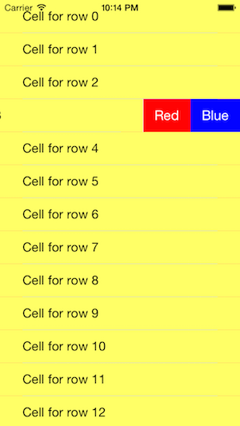

# UITableView and custom edit actions

This sample project shows how to provide custom actions on cells.

Idea is to replace the standar "Delete" button that appear on right of cell when user swipes to the left, like on the image bellow:



## Content

This project is written in Swift. You'll find two classes:

1. The application delegate, as generated by the Xcode templates.
2. The table view controller *StaticTable*. This object is also the table delegate and it's data source.
3. Application UI is specified in a storyboard file.

## Enabling swipe to left action

The data source must implement the method

```swift
func tableView(
	tableView: UITableView, 
	commitEditingStyle editingStyle: UITableViewCellEditingStyle, 
	forRowAtIndexPath indexPath: NSIndexPath
	)
{
	// Don't do anything here, unless you implement a delete or move action
}
```

### Providing custom actions

This part of the job is implemented by the table view delegate.

You need to implement the method:

```swift
override func tableView(
	tableView: UITableView,
	editActionsForRowAtIndexPath indexPath: NSIndexPath
	) -> [AnyObject]?
{
	return rowActions
}
```

The `rowActions` value returned is a variable in the delegate object. 

```swift
var rowActions = [ UITableViewRowAction ]()
```

In the example it is initialized when view is ready to be displayed.

```swift
override internal func viewDidLoad()
{
	// ... do stuff before
	
	// Build a list of actions for cells
	
	// Create an action
	var blueAction = UITableViewRowAction(style: .Normal, title: "Blue", handler: {
            (action, indexPath) in
            NSLog("Perform action \( action.title )")
        })
    
    // And perform some basic init    
	blueAction.backgroundColor = UIColor.blueColor()
        
	rowActions.append(blueAction)
	// ...
}
```

The action cal be implemented of called in the handler closure specified when the action object is created.
